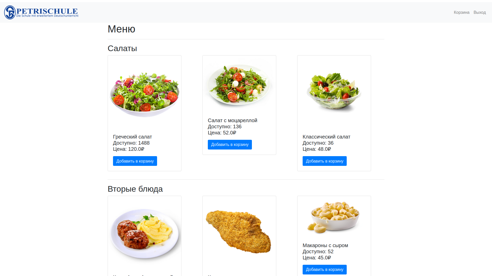
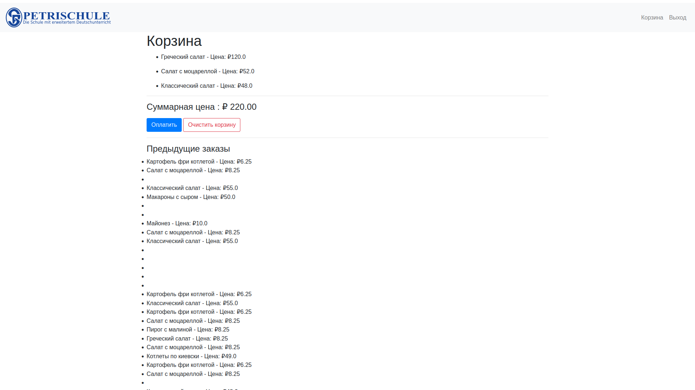
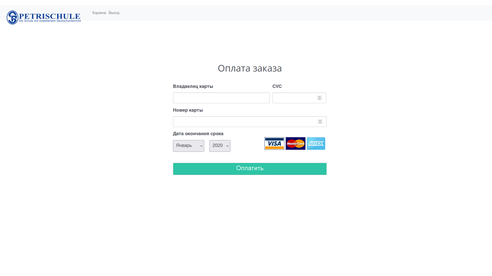

# About project
This is a website for a basic school canteen; it can also be used to turn it into a restaurant website.
The site is written in the Python programming language. I used Django as my main framework. Bootstrap is connected to Html so that you can use the site on any device, that is, on phones, tablets and PCs.

## install Django
`python -m pip install Django`

## activate and install venv
### install
`python -m venv `
### activate
`source venv/bin/activate`

## run project
`python manage.py runserver`

## Screenshots ↓
### Homepage

### Basket

### Payment
